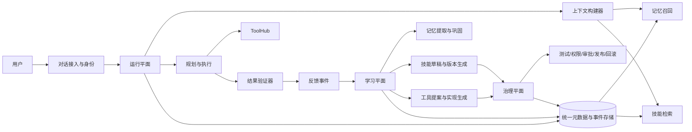
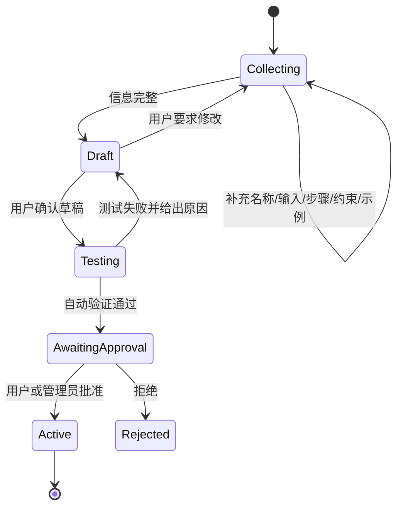

# Skill Agent 目标架构评审与演进方案

> 评审日期：2026-07-20  
> 评审范围：当前仓库中的对话主链、技能沉淀、工具执行、长期记忆、自我反思、审批与测试设计。  
> 项目目标：创建一个能够通过持续对话沉淀技能和工具、拥有长期记忆，并能在受控条件下持续改进的智能体。

## 1. 执行结论

当前工程的技术方向基本正确，已经具备对话入口、任务规划、技能 YAML、工具中心、执行 DAG、记忆存储、执行批评和人工审批等基础模块，可以作为目标系统的原型继续演进。

但当前实现还没有形成可靠的学习闭环，暂时只能实现：

- 从一轮完整、明确的用户教导中抽取技能，并保存为 YAML。
- 在同一进程和同一 `client_id` 下维持短期对话上下文。
- 调用已有的天气、搜索工具，或者执行由这些工具组成的简单 DAG。
- 记录部分工具执行结果，并展示失败、反思和待审批 patch。

当前尚不能可靠实现：

- 通过多轮对话逐步教会一个技能。
- 在服务重启或 Session 过期后恢复对话、偏好和任务上下文。
- 稳定召回并执行不依赖工具的纯方法论技能。
- 根据用户纠正自动形成可验证的新技能版本。
- 通过对话创建、测试、授权并发布新的可执行工具。
- 根据真实任务质量而不是“工具调用成功”完成自我改进。

因此，项目当前应定义为“具备技能沉淀能力的多 Agent 原型”，而不是“已经拥有长期记忆和持续成长能力的智能体”。目标可以实现，但需要先统一数据模型并打通一条可验证的端到端闭环，再扩展自动反思和工具生成。

## 2. 目标边界

要实现预期目标，必须明确区分以下四类对象。

| 对象 | 含义 | 当前承载方式 | 目标状态 |
|---|---|---|---|
| 对话上下文 | 当前任务所需的短期消息和临时状态 | 进程内 `Context` | 可恢复、可压缩、按用户和会话隔离 |
| 长期记忆 | 用户偏好、事实、经验、任务结果和纠正 | JSON 文件、JSONL、SQLite 三套存储 | 统一接口、可追溯、可遗忘、按作用域检索 |
| 技能 | 可复用的方法、流程、输入输出约束和评测样例 | YAML 中的 `method + steps` | 不可变版本、验证后发布、可回滚 |
| 工具 | 能产生外部副作用或访问外部能力的可执行程序 | Python Tool、MCP Tool | 权限明确、沙箱测试、审批发布、可禁用 |

“记住用户喜欢怎样写日报”属于长期记忆；“怎样生成日报”属于技能；“读取企业日报系统并提交”属于工具。三者不能用同一份提示词或 YAML 模糊表达。

## 3. 当前架构与实际数据流

### 3.1 对话执行链

```text
Frontend / CLI / Streamlit
  -> WebSocket dispatcher 或 Agent.chat()
  -> Agent.handle()
  -> ManagerAgent.plan()
  -> LearningAgent.execute_dag()
  -> OrchestratorAgent.stream()
  -> ExecutionCritic.evaluate()
```

主要入口位于：

- `backend/websocket_handler.py`
- `backend/session.py`
- `core/agent.py`
- `agents/manager.py`
- `agents/learning.py`
- `agents/orchestrator.py`

### 3.2 显式技能教导链

```text
用户输入
  -> 规则判断为 TEACH
  -> SkillTrainer.detect()
  -> LLM 抽取 Skill
  -> 相似技能判断
  -> 写入 skills/user/{name}@{version}.yaml
  -> 注册到内存 SkillRegistry
```

该链路能够生成技能文件，但交互式补充、更新选择、验证、发布和回滚尚未形成状态机。

### 3.3 当前“自我进化”链

```text
工具执行结果
  -> ExecutionCritic
  -> failures / successes / pending patch
  -> 人工 approve
  -> 尝试更新 skill YAML
```

这条链目前只评估工具返回状态，没有评价最终回答是否满足用户目标，也没有可靠接收下一轮用户纠正。

### 3.4 当前存在的四套状态

```text
Context              进程内短期消息
MemoryStore          failures / successes / patches JSON 文件
SemanticMemoryStore  SQLite + FTS + embedding
SkillStore           YAML + 进程内 Registry
```

这些模块各自存在，但没有共享统一的用户、会话、执行、反馈和版本标识，因此无法构成稳定闭环。

## 4. 关键审查发现

### 4.1 P0：纯方法论技能沉淀后无法稳定复用

`ManagerAgent` 只有在规划结果包含 `tool_tasks` 时，才返回携带 `selected_skill` 的 `SKILL` 计划；没有工具任务时会进入 `CHITCHAT` 或 `UNKNOWN` 分支。参见 `agents/manager.py:279`。

当前已经生成的日报技能全部为 `tool: null`，例如 `skills/user/DailyReportGenerator@1.0.0.yaml:17`。这类技能虽然能被写入文件和显示在技能列表中，但执行时可能丢失选中的技能，最终不会稳定使用其方法论。

目标行为应当允许以下三种计划独立存在：

- 仅使用 LLM 和方法论技能。
- 使用技能声明的工具 DAG。
- 不使用技能，直接回答。

不能用“是否有工具任务”判断“是否是技能任务”。

### 4.2 P0：多轮教学没有显式状态

当教导信息不完整或发现相似技能时，`SkillTrainer` 会返回追问文本，但没有保存以下状态：

- 当前正在教哪个技能。
- 已收集和仍缺失的字段。
- 当前等待用户回答哪个问题。
- 用户是在选择更新、创建还是取消。
- 草稿由哪些对话证据生成。

`core/agent.py:283` 中的 `_complete_teaching()` 还调用了 `Agent` 上不存在的 `self.llm`；异常被捕获后只返回通用提示。该方法同时把助手生成的追问拼接后写成用户消息，破坏了消息角色语义。

结果是系统可以完成单轮抽取，但不能可靠完成“你先问我几个问题，我逐步回答，最后确认保存”的自然教学过程。

### 4.3 P0：长期记忆没有接入生产主链

`backend/session.py:29` 的 `SessionManager` 完全驻留在进程内。Session 超时、进程重启或多实例部署都会丢失上下文。

语义记忆实现了 SQLite、FTS 和向量检索，但存在三个断点：

1. 生产对话链没有调用 `add_memory()` 或 `add_sync()` 写入对话、偏好和任务结果。
2. 启动流程没有初始化 embedding 服务并绑定到 `SemanticMemoryStore`。
3. `agents/manager.py:374` 在异步规划链中用 `run_until_complete()` 调用异步检索，运行时会失败并被静默忽略。

审阅时 `semantic_memory.db` 中实际记录数为 0。这说明当前语义记忆主要是一个通过单元测试的独立组件，而不是 Agent 正在使用的长期记忆。

### 4.4 P0：自我改进 patch 的生成与应用协议不一致

`ExecutionCritic` 生成的建议结构主要是：

```json
{
  "type": "improve_skill",
  "target_skill": "...",
  "recommendations": ["..."]
}
```

而 `backend/main.py:281` 的审批接口只在 suggestion 中存在 `method` 字段时才更新技能。这意味着系统自动生成的多数 patch 即使获批，也不会修改任何文件。

同时，高置信度 patch 被设置为 `auto_approved` 后没有落盘、没有应用、没有发布新版本，也没有留下完整审计记录。当前实现不能视为已经具备自动进化能力。

### 4.5 P1：执行评价不代表任务成功

当前成功率的定义是：

```text
成功工具数 / 工具总数
```

没有工具的任务自动得到 100% 成功率；工具成功但最终答案错误，也会被记录为成功。以下关键信号尚未进入评价：

- 用户是否接受结果。
- 用户是否纠正、重做或放弃。
- 最终输出是否满足结构化约束。
- 是否通过技能自带的评测样例。
- 任务是否产生预期外部状态。
- 用户对内容、格式、准确性和时效性的评分。

此外，`core/critic.py:354` 中 fallback 和 retry 仍为固定值，工具名称也由 task id 推断，导致反思数据不准确。

### 4.6 P1：执行标识会导致记录覆盖

`core/agent.py:24` 在 `Agent` 初始化时只生成一次 `trace_id`，同一 Session 中的所有请求都复用它。失败记录以 `{trace_id}.json` 保存，后续失败会覆盖此前记录。

应当区分：

- `user_id`：长期身份。
- `session_id`：一段会话。
- `turn_id`：一次用户输入。
- `execution_id/trace_id`：一次实际执行尝试。

每次 `handle()` 都应创建新的执行标识，并在重试时通过 `parent_execution_id` 建立关系。

### 4.7 P1：技能版本模型不能支撑演进

磁盘可以存在同名多版本文件，但 `SkillRegistry` 使用 `name -> Skill` 存储，每个名称最终只能保留一个对象。哪个版本生效依赖文件扫描和加载顺序，而不是明确的 active 版本指针或语义版本规则。

`SkillUpdaterAgent` 修改内存对象后又调用 `store.add(skill)`，同版本会触发冲突；`SkillManagerAgent` 本身也没有接入 `Agent.handle()` 主链。

目标设计应当把技能版本视为不可变制品：旧版本不能原地覆盖，新修改必须生成新版本，通过验证后再切换 active 指针。

### 4.8 P1：当前系统不能通过对话创建新工具

规划 schema 和 system prompt 把可选工具硬编码为 `weather_query` 和 `web_search`，参见 `agents/manager.py:69` 和 `agents/manager.py:103`。

当前技能沉淀只能做到：

- 保存一段方法论。
- 保存对现有工具的引用和参数模板。

它不能把用户描述转换为新的 Python、HTTP 或 MCP 工具并安全启用。新增工具需要独立的提案、生成、测试、权限审查、人工审批、注册和回滚流程。

### 4.9 P1：缺少多用户隔离和管理面权限

当前接口没有身份认证和授权，CORS 对所有来源开放。调用者可以删除技能、持久化 feature flag、审批 patch；WebSocket 的 `client_id` 也完全由客户端指定。

如果系统只在单机个人环境使用，可以暂时接受；如果准备远程部署或多人使用，这属于发布前必须解决的问题。

### 4.10 P2：测试全绿不能证明目标闭环成立

当前测试结果：

```text
212 passed, 1 skipped
```

主要缺口包括：

- 唯一的 WebSocket 集成测试被跳过。
- 语义记忆的“集成测试”只验证独立 Store，没有经过 `Agent.handle()`。
- 技能管理测试对检索和重复分析结果没有有效断言，返回空列表也会通过。
- 没有“教导后重启，再次对话能召回并执行”的端到端测试。
- 没有“用户纠正后发布新版本，再回归验证”的测试。
- 前端没有自动化测试脚本。

## 5. 目标架构

建议将系统划分为运行平面、学习平面、治理平面和统一存储层。



### 5.1 运行平面

职责：只负责稳定完成当前任务，不直接修改已发布技能或执行未批准代码。

核心组件：

- Identity and Session：解析 `user_id/session_id/turn_id`。
- Context Builder：组合近期会话、长期记忆、用户偏好和技能上下文。
- Skill Retriever：从 active 技能版本中检索候选项。
- Planner：决定直接回答、使用方法论技能、执行工具 DAG 或请求澄清。
- Executor：执行工具、重试、fallback 和超时控制。
- Validator：检查结构、事实、业务约束和外部状态。
- Response Synthesizer：生成最终回答并附带可观测执行信息。

### 5.2 学习平面

职责：把对话和反馈转换为候选记忆、技能草稿或工具提案，不直接发布。

核心组件：

- Teaching Session：多轮教学状态机。
- Memory Extractor：识别偏好、事实、项目上下文和经验。
- Feedback Classifier：区分确认、纠正、偏好、重试和新要求。
- Skill Draft Builder：生成结构化技能草稿和评测样例。
- Skill Evolver：基于失败和反馈生成新版本候选。
- Tool Proposal Builder：把新能力需求转换为工具规格和权限声明。

### 5.3 治理平面

职责：保证学习结果可以验证、审计和回滚。

核心组件：

- Schema Validator。
- Skill and Tool Test Runner。
- Permission and Secret Review。
- Human Approval Queue。
- Version Publisher。
- Rollback Manager。
- Audit Log。

### 5.4 统一存储层

建议以关系数据库保存权威元数据和状态，以对象/文件存储保存技能制品和大对象，以向量索引作为可重建的检索派生数据。

第一阶段可以继续使用 SQLite，但需要一个统一 Repository 层；业务代码不应同时直接读写 JSON、JSONL、SQLite 和 YAML。

## 6. 核心数据模型

### 6.1 身份、会话和执行

```text
User
  id
  tenant_id
  profile

Session
  id
  user_id
  status
  summary
  created_at / updated_at

Turn
  id
  session_id
  user_message
  assistant_message
  intent

Execution
  id
  turn_id
  parent_execution_id
  skill_id / skill_version
  plan
  tool_calls
  final_output
  validation_result
  status
  latency
```

### 6.2 长期记忆

```text
MemoryItem
  id
  tenant_id
  user_id
  scope              global / user / project / session
  type               fact / preference / context / episode / lesson
  content
  structured_value
  source_turn_id
  confidence
  sensitivity
  valid_from / valid_until
  supersedes_id
  status             candidate / active / rejected / expired
  created_at / updated_at
```

长期记忆必须支持：

- 来源追踪：为什么记住这条内容。
- 冲突处理：新旧偏好不一致时如何取舍。
- 有效期：临时项目事实不能永久保留。
- 用户控制：查看、修改、删除和禁止记忆。
- 敏感数据控制：密钥、身份证号等默认不得进入记忆。

### 6.3 技能及版本

```text
Skill
  id
  owner_scope
  name
  active_version
  status

SkillVersion
  skill_id
  version
  capability
  triggers
  preconditions
  input_schema
  output_schema
  method
  steps
  tool_requirements
  permissions
  examples
  evaluation_cases
  provenance
  parent_version
  status             draft / testing / review / active / retired
  created_at
```

技能版本必须不可变。任何更新都生成新版本，测试通过后再修改 `active_version`。

### 6.4 工具及版本

```text
Tool
  id
  name
  owner_scope
  active_version

ToolVersion
  tool_id
  version
  runtime            python / http / mcp
  input_schema
  output_schema
  implementation_ref
  permissions
  secret_refs
  network_policy
  side_effect_level
  test_cases
  status             proposal / sandboxed / review / active / disabled
```

工具中只保存 secret 引用，不能保存明文 secret。

### 6.5 反馈和评测

```text
FeedbackEvent
  id
  execution_id
  type               accept / reject / correction / retry / rating
  content
  explicit
  created_at

EvaluationResult
  execution_id
  evaluator
  dimensions
  score
  evidence
  passed
```

## 7. 关键闭环设计

### 7.1 多轮技能教学



每次教学必须有持久化 `teaching_session_id`，不能只根据最近几条聊天猜测当前状态。

技能发布前至少检查：

- 名称和能力边界明确。
- 输入输出 schema 合法。
- 引用工具存在且权限允许。
- DAG 无循环且参数引用有效。
- 至少有一个正向样例和一个边界样例。
- 回归样例通过。
- 用户看到最终草稿并明确确认。

### 7.2 运行时召回和执行

```text
识别用户与会话
  -> 读取近期消息和 Session 摘要
  -> 检索用户偏好、项目上下文和历史经验
  -> 检索 active 技能版本
  -> 规划执行方式
  -> 校验输入和权限
  -> 执行工具或方法论
  -> 验证最终结果
  -> 记录 Execution 和候选反馈
```

技能检索不应只依赖关键词或让 LLM 在全部技能中自由选择。建议采用：

1. 结构化过滤：用户作用域、状态、工具可用性和权限。
2. 关键词与向量召回候选技能。
3. LLM 或轻量 reranker 对少量候选重排。
4. 低置信度时询问用户，而不是强行选择。

### 7.3 用户纠正驱动的技能演进

```text
用户纠正结果
  -> 绑定原 execution_id
  -> 分类纠正属于输入、方法、工具还是输出格式
  -> 形成 SkillVersion draft
  -> 添加纠正内容作为回归样例
  -> 运行旧样例 + 新样例
  -> 展示差异和风险
  -> 审批并切换 active_version
```

不能原地修改正在使用的 YAML，也不能仅凭一次隐式追问自动更新技能。

### 7.4 新工具生成与发布

```text
发现现有工具无法满足需求
  -> 生成 Tool Proposal
  -> 明确接口、权限、副作用和 secret 需求
  -> 在隔离目录生成实现
  -> 静态检查和单元测试
  -> 沙箱运行及网络/文件权限限制
  -> 人工审查代码和权限
  -> 发布 ToolVersion
  -> 注册到 ToolHub
  -> 失败时禁用或回滚
```

建议先支持声明式 HTTP/MCP 工具，再考虑生成任意 Python 代码。声明式工具更容易限制权限、验证输入输出和审计副作用。

## 8. 记忆策略

### 8.1 分层记忆

| 层级 | 内容 | 生命周期 | 召回方式 |
|---|---|---|---|
| 工作记忆 | 当前规划、工具结果、教学草稿 | 当前 Turn | 直接读取 |
| 会话记忆 | 最近消息、Session 摘要 | 数小时到数天 | session_id |
| 情景记忆 | 历史任务、执行结果、用户纠正 | 可配置 | 混合检索 |
| 语义记忆 | 稳定事实、偏好、项目规则 | 长期 | 结构化过滤 + 混合检索 |
| 程序记忆 | 已发布技能和工具 | 版本化长期保存 | 技能/工具 Registry |

### 8.2 写入策略

不是所有对话都应成为长期记忆。推荐流程：

```text
消息/执行结果
  -> 提取候选记忆
  -> 敏感信息检查
  -> 去重和冲突检测
  -> 置信度与有效期判断
  -> 自动保存低风险事实，或请求用户确认
  -> 建立 source_turn_id
```

### 8.3 召回策略

召回必须带作用域过滤，最少包含 `tenant_id + user_id`。项目记忆还应包含 `project_id`。检索结果应按相关性、时效性、置信度和重要度共同排序，并限制注入 token 数量。

### 8.4 遗忘和纠错

需要提供以下用户能力：

- “你记住了我什么”。
- “忘掉这件事”。
- “这个偏好已经变了”。
- “仅在这个项目中使用该规则”。

删除权威记录后，相关向量索引和缓存也必须同步失效。

## 9. 安全与治理原则

### 9.1 默认不自动执行新代码

模型生成的技能描述可以作为草稿自动保存；模型生成的工具实现不能未经测试和审批直接进入运行时。

### 9.2 最小权限

每个工具版本显式声明：

- 可访问的域名。
- 可读写的目录。
- 是否允许执行子进程。
- 需要的 secret 引用。
- 是否有外部副作用。
- 是否需要每次执行前确认。

### 9.3 审计和回滚

任何技能或工具发布都必须记录：

- 提案来源。
- 生成模型和提示版本。
- 代码或配置差异。
- 测试结果。
- 审批人。
- 发布时间。
- 被替代版本。

### 9.4 多用户隔离

管理 API、WebSocket 和存储都必须基于经过验证的身份，而不是信任客户端提交的 `client_id`。个人部署也建议保留 owner token，防止同网段未授权操作。

## 10. 分阶段演进路线

### 里程碑 M0：建立可信基线

目标：先证明现有系统能稳定执行和观察。

工作项：

- 每个 Turn 生成唯一 `execution_id`。
- 补齐工具名、retry、fallback 和错误信息的执行记录。
- 修复 WebSocket 集成测试并取消 skip。
- 为前端增加最小 API/WebSocket 自动化测试。
- 增加一个真实端到端测试夹具，隔离运行时数据。

验收：一次任务的消息、计划、工具调用、最终输出和评价能通过同一个 execution id 完整追踪。

### 里程碑 M1：打通技能教学和复用闭环

目标：可靠完成一个纯方法论技能，例如日报生成。

工作项：

- 引入持久化 TeachingSession 状态机。
- 允许无工具的 `selected_skill` 正常执行。
- 技能版本不可变，并增加 active 版本指针。
- 增加 schema、DAG、工具依赖和样例验证。
- 用户确认后才发布技能。
- 修复重复技能的更新、创建和取消流程。

验收场景：

1. 用户通过三轮对话教会日报技能。
2. 服务重启。
3. 用户发送当天工作记录。
4. 系统召回已发布技能并按约束输出日报。
5. 执行记录明确标识使用的技能版本。

### 里程碑 M2：打通长期记忆

目标：让偏好、事实和上下文跨 Session 可恢复。

工作项：

- 建立统一 MemoryRepository。
- 在主链路接入候选记忆提取、写入和异步召回。
- 初始化 embedding 服务，并允许全文检索降级。
- 增加用户、项目和 Session 作用域。
- 增加来源、置信度、有效期、冲突和删除机制。
- 用 Session 摘要替代无限保存原始消息到 prompt。

验收场景：服务重启后，系统能正确恢复用户确认过的偏好；另一用户无法召回该偏好；用户删除后不再召回。

### 里程碑 M3：反馈驱动的技能版本演进

目标：将用户纠正转化为可验证、可回滚的新版本。

工作项：

- FeedbackEvent 绑定 execution id。
- 建立结果 Validator 和技能评价集。
- 统一 patch schema。
- patch 审批生成新版本，不原地更新。
- 发布前运行旧样例和新增纠正样例。
- 增加版本级成功率、回退率和用户接受率。

验收场景：用户纠正日报格式后生成候选 `1.0.1`；测试通过并确认发布；旧版本仍可查看和一键回滚。

### 里程碑 M4：受控工具沉淀

目标：允许通过对话提出并发布新的工具能力。

工作项：

- 先实现声明式 HTTP/MCP Tool Proposal。
- 增加输入输出 schema 和权限 manifest。
- 建立隔离测试运行器。
- 增加 secret 引用和网络白名单。
- 人工审批后注册到 ToolHub。
- 最后再评估是否支持生成 Python 工具。

验收场景：用户描述一个只读 HTTP API；系统生成提案和测试；管理员批准；工具注册并被技能引用；禁用后规划器不再选择它。

## 11. 推荐的首个纵向用例

建议以“日报技能”为第一个完整样板，而不是立即扩展更多 Agent 或工具。

该用例同时覆盖：

- 多轮教学。
- 用户偏好记忆。
- 无工具技能选择。
- 结构化输出验证。
- 服务重启后召回。
- 用户纠正。
- 技能版本升级和回滚。

建议的教学对话：

```text
用户：以后帮我整理日报。
系统：需要包含哪些栏目？
用户：今日完成、问题、明日计划。
系统：风格和敏感信息有什么要求？
用户：简洁，但不要太简单，不披露客户名称和内部地址。
系统：展示技能草稿、输入输出样例和约束，请用户确认。
用户：确认。
系统：验证并发布 DailyReport v1.0.0。
```

后续纠正：

```text
用户：问题部分如果没有内容就不要显示。
系统：将纠正绑定到上次执行，生成 v1.0.1 草稿和新增回归样例。
用户：确认更新。
系统：测试通过后切换 active 版本，保留 v1.0.0 以便回滚。
```

## 12. 测试与验收矩阵

| 能力 | 必须覆盖的测试 |
|---|---|
| 短期上下文 | 多轮指代、重试、Session 隔离、TTL |
| 长期记忆 | 写入、重启恢复、用户隔离、冲突、删除、过期 |
| 技能教学 | 信息不足追问、草稿修改、取消、确认发布 |
| 技能检索 | 纯方法论技能、工具技能、低置信度澄清、禁用版本 |
| 技能执行 | 输入校验、DAG、retry、fallback、超时、输出校验 |
| 技能演进 | 用户纠正、新版本、回归失败阻止发布、回滚 |
| 工具治理 | schema、权限、沙箱、secret、审批、禁用 |
| API/WebSocket | 身份、重连、事件顺序、错误恢复、未授权访问 |
| 并发与部署 | 同用户多 Session、多用户、进程重启、多实例一致性 |

最关键的验收不是单元测试数量，而是以下端到端闭环全部可重复通过：

```text
Teach -> Confirm -> Persist -> Restart -> Recall -> Execute
      -> Correct -> Version -> Test -> Approve -> Rollback
```

## 13. 近期不建议做的事情

在 M1 和 M2 完成前，不建议：

- 继续增加更多职责重叠的 Agent 类。
- 开启高置信度 patch 自动发布。
- 允许模型直接生成并执行 Python 工具。
- 把所有对话原文无差别写入长期记忆。
- 依靠提示词解决教学状态、版本状态和权限状态。
- 用更多向量库替代尚未打通的数据写入和身份隔离。

## 14. 最终判断

当前设计不是需要全部推倒重来。以下部分可以保留并逐步改造：

- FastAPI、WebSocket 和前端接入。
- `Agent -> Manager -> Learning -> Orchestrator` 主执行骨架。
- `ToolHub` 和 Tool 抽象。
- Skill YAML 的基础字段和 DAG 思路。
- Memory、Critic、Reflect 和审批界面的原型。

真正需要改变的是系统中心：从“多个功能模块并列存在”转为“围绕统一身份、执行记录、反馈事件和不可变技能版本形成闭环”。

完成 M0-M3 后，工程可以实现一个有长期记忆、能从显式教导和用户纠正中持续沉淀技能的智能体。完成 M4 并建立可靠沙箱与治理后，才适合宣称系统能够通过对话持续沉淀新的可执行工具。
